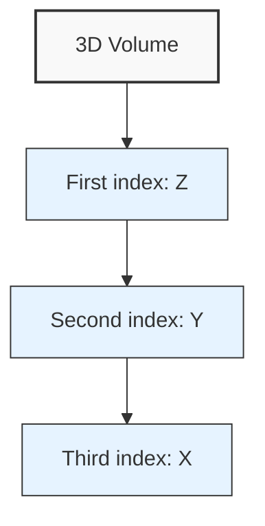

# Understanding Array Dimensions in NumPy and PyTorch: The XYZ vs. ZYX Convention

When working with 3D volumes in scientific computing, particularly in fields like electron tomography, it's crucial to understand how data is stored and accessed in popular libraries like NumPy and PyTorch. A common source of confusion for beginners is the difference between the intuitive XYZ coordinate system and the ZYX indexing used in these libraries.

## Technical Background

In tomography, we often work with 3D volumes represented as multidimensional arrays. These volumes are typically stored in file formats like MRC, where the convention is to have X as the fastest-changing dimension and Z as the slowest-changing dimension. This aligns with how data is typically laid out in memory for efficiency.

However, when we load these volumes into NumPy or PyTorch arrays, the indexing order is reversed. This is because these libraries use C-order (row-major) for memory layout, which results in the last axis being the fastest-changing dimension.

## The Indexing Dilemma

Let's say we have a 3D volume with dimensions (100, 200, 300) in XYZ order. When loaded into a NumPy array, it would be represented as:

```python
import numpy as np

# Creating a sample 3D array
volume = np.zeros((100, 200, 300))  # ZYX order in NumPy
print(volume.shape)  # Output: (100, 200, 300)
```

Here, the shape (100, 200, 300) represents (Z, Y, X) in NumPy, not (X, Y, Z) as one might intuitively expect.

## C-style Array Indexing Visualization

When working with 3D volumes, it's helpful to visualize how the indexing actually works:



<figure markdown>
  <svg width="400" height="300" xmlns="http://www.w3.org/2000/svg">
    <!-- 3D Cube representing volume -->
    <rect x="50" y="50" width="200" height="200" fill="none" stroke="black" stroke-width="2"/>
    <rect x="100" y="100" width="200" height="200" fill="none" stroke="black" stroke-width="2"/>
    <line x1="50" y1="50" x2="100" y2="100" stroke="black" stroke-width="2"/>
    <line x1="250" y1="50" x2="300" y2="100" stroke="black" stroke-width="2"/>
    <line x1="50" y1="250" x2="100" y2="300" stroke="black" stroke-width="2"/>
    <line x1="250" y1="250" x2="300" y2="300" stroke="black" stroke-width="2"/>
    
    <!-- Axis labels -->
    <text x="320" y="200" font-family="Arial" font-size="24">X</text>
    <text x="150" y="270" font-family="Arial" font-size="24">Y</text>
    <text x="70" y="80" font-family="Arial" font-size="24">Z</text>
    
    <!-- Indexing demonstration -->
    <text x="150" y="40" font-family="Arial" font-size="18">volume[z, y, x]</text>
    <text x="320" y="330" font-family="Arial" font-size="16">Fastest changing</text>
    <text x="30" y="30" font-family="Arial" font-size="16">Slowest changing</text>
  </svg>
  <figcaption>In NumPy/PyTorch, the indexing order (z,y,x) goes from slowest to fastest changing dimension</figcaption>
</figure>

In this C-style layout:
- The first index (Z) selects a 2D slice (Y,X)
- The second index (Y) selects a 1D row (X)
- The third index (X) selects the individual voxel

This is why ZYX ordering is more natural when working with NumPy and PyTorch, as it aligns with how the data is actually stored in memory.

## Accessing Elements

To access a specific voxel at position (x=50, y=100, z=25), you would need to index the array as follows:

```python
voxel_value = volume[25, 100, 50]  # Note the ZYX order
```

This reversal can lead to confusion and errors if not properly understood and managed.

## Potential Solutions

### 1. Adopt the ZYX Convention

At TeamTomo, we recommend embracing the ZYX order when working with NumPy and PyTorch arrays. This aligns with how these libraries handle multidimensional data and can lead to more intuitive code when performing operations along specific axes.

```python
# Example of iterating through Z slices
for z in range(volume.shape[0]):
    slice_xy = volume[z, :, :]
    # Process the XY slice
```

### 2. Mental Translation

If you prefer thinking in XYZ coordinates, you can mentally translate when indexing arrays. However, this approach can be error-prone and is not recommended for large-scale projects.

### 3. Array Transposition

You can transpose the array to change the order of dimensions. However, this operation can be computationally expensive for large volumes and may lead to confusion if not consistently applied.

```python
volume_xyz = np.transpose(volume, (2, 1, 0))
print(volume_xyz.shape)  # Output: (300, 200, 100)
```

## Conclusion

Understanding the ZYX convention used in NumPy and PyTorch is essential for accurate data manipulation in tomography and other 3D imaging fields. While it may seem counterintuitive at first, adopting this convention can lead to more efficient and less error-prone code.

For more information and resources on best practices in tomography, visit [teamtomo.org](https://teamtomo.org). We're here to support you in your journey through the world of 3D scientific imaging!